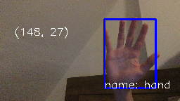

# Report

Group:
Yinxuan Feng, Shuohe Ren, and HaeJong Yoo

## Description

    1.1 Our program recognizes 5 gestures: open hand, index finger, fist, scrolling up, and scrolling down.

    1.2 We preprocess the templates by first converting them to black and white images. We scale the images by 0.2, and then use dynamic background substraction to make static objects black and moving objects white. For gesture static recognization, we use template matching for each one, and set a threshold for every template. We find the one with the most probability and draw that one on the canvas. For scrolling motions, we compare 15 consecutive frames, and check if the recognized gesture is moving up or down. For those frames, as there might be 1 or 2 frames inside it was missed, we preprocess that so the minor misses will be ignored. After recognition, we draw boxes of the objects, and label the coordinates. If there are motions, we label the detected motions.

## Confusion Matrix
2.1 

|                 |             |Actual class|                	|           |				|
|-----------------|-------------|------------|------------------|-----------|---------------|
|                 |             | Open Hand	 | Index Finger 	|  Fist 	| No gesture 	|
| Predicted class | Open Hand   | 5          | 0           		| 0         | 0 			|
|                 | Index Finger| 0          | 4              	| 0         | 0 			|
|                 | Fist 		| 0          | 1              	| 5         | 0 			|
|                 | No gesture 	| 0          | 0              	| 0         | 5 			|

2.2 

|                 |                | Actual class |                |            |
|-----------------|----------------|--------------|----------------|------------|
|                 |                | Scrolling up | Scrolling down | No gesture |
| Predicted class | Scrolling up   | 5            | 0              | 0          |
|                 | Scrolling down | 0            | 4              | 0          |
|                 | No gesture     | 0            | 1              | 5          |

Highest precision: 
open hand: precision = 1, recall = 1, F1 = 1

Lowest precision:
fist: precision = 0.8333, recall = 1, F1 = 0.9091

## Success and failure cases
 

Up: good open hand. Down: hand too big

 

 

Up: good index finger. Down: wrong orientation

 

 

Up: good fist. Down: fist blocked by phone

 

 

Up: good scrolling up. Down: moving too slow

 

 

Up: good scrolling down. Down: waving too hard that it is not considering scrolling down

 

